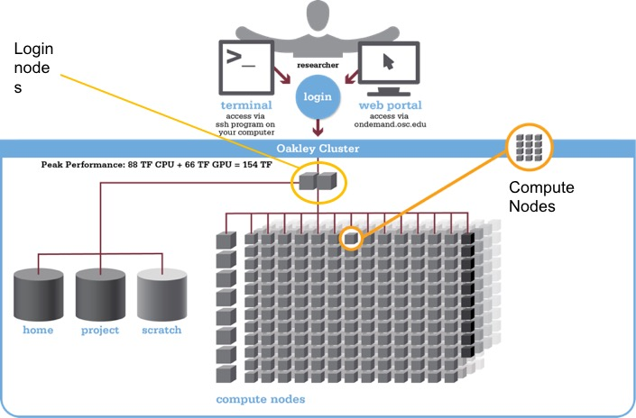

The words "cloud", "cluster", and "high-performance computing" get thrown around a lot.
So what do they mean exactly?
And more importantly, how do we use them for our work?

The "cloud" is a generic term commonly used to refer to remote computing resources.
Cloud can refer to webservers, remote storage, API endpoints, and as well as more traditional "raw compute" resources. 
A cluster on the other hand, is a term used to describe a network of compters.
Machines in a cluster typically share a common purpose, 
and are used to accomplish tasks that might otherwise be too substantial for any one machine. 


## High performance computing

A high-performance computing cluster is a set of machines that have been 
designed to handle tasks that normal computers can't handle.
This doesn't always mean simply having super fast processors. 
High-performance computing covers a lot of use cases.
Here are a couple of use cases where high-performance computing becomes extremely useful:

* You need access to large numbers of CPUs.
* You need to run a large number of jobs.
* Your jobs are running out of memory.
* Perhaps you need to store tons and tons of data.
* You require an exceptionally high-bandwidth internet connection for data transfer.
* You need a safe archival site for your data.
* Your compute jobs require specialized GPU or FPGA hardware.
* Maybe your jobs just take a long time to run.

Chances are, you've run into one of these situations before.
Fortunately, high-performance computing installations exist to solve these types of problems.

## HPC Terminology

These are some useful HPC terms.

| Cluster | A group of computers (nodes) connected by a high-speed network, forming a supercomputer |
| Node | Equivalent to a high-end workstation, unit of a cluster |
| Core | A processor (CPU), multiple cores per node |
| FLOPS | Floating Point Operations Per Second, Measure of processing capacity |
| GPU | Graphical Processing Unit, separate processor from core |



This graphic is a general view of the parts of a cluster. For specific details on the clusters at OSC, check out our 
Cluster Computing webpage: [https://www.osc.edu/services/cluster_computing](https://www.osc.edu/services/cluster_computing)

## Logging onto the cluster

You should be logged into OnDemand, we will open a terminal window from the Dashboard. Use the Clusters pulldown menu
and choose "Pitzer Shell Access".

## Where are we? 

Very often, many users are tempted to think of a high-performance computing installation as one giant, magical machine.
Sometimes, people even assume that the machine they've logged onto is the entire computing cluster.
So what's really happening? What machine have we logged on to?
The name of the current computer we are logged onto can be checked with the `hostname` command.


```
hostname
```
{: .bash}
```
pitzer-login04.hpc.osc.edu
```
{: .output}

Clusters have different types of machines customized for different types of tasks.
In this case, we are on a login node.
A login node serves as a gateway to the cluster and serves as a single point of access.
As a gateway, it is well suited for uploading and downloading files, setting up software, and running quick tests.
It should never be used for doing actual work. Login nodes only have 1GB RAM and 20 minutes CPU time.

The real work on a cluster gets done by the compute nodes.
Compute nodes come in many shapes and sizes, but generally are dedicated to doing all of the heavy lifting that needs doing. 
All interaction with the compute nodes is handled by a specialized piece of software called a scheduler. We use the Moab scheduler.
We can view all of the worker nodes with the `pbsnodes -a` command. But this would be overwhelming since we have over 800 compute nodes, so we'll abbreviate it instead.

```
pbsnodes -a | tail -n 50
```
{: .bash}
```
o0464
     state = job-exclusive
     power_state = Running
     np = 28
     properties = broadwell-ep,c6320,ib-i1l1s18,ib-i1,eth-owens-rack07h1,owens-rack07-c08,owens-rack07,owens,pfsdir,ime
     ntype = cluster
     jobs = 0-27/3816217.owens-batch.ten.osc.edu
     status = opsys=linux,uname=Linux o0464.ten.osc.edu 3.10.0-693.37.4.el7.x86_64 #1 SMP Fri Aug 10 12:34:55 EDT 2018 x86_64,sessions=2618 147256,nsessions=2,nusers=2,idletime=44307,totmem=182247896kb
,availmem=167945740kb,physmem=131916252kb,ncpus=28,loadave=23.14,gres=,netload=1368471174094,size=899955648kb:909207804kb,state=free,varattr= ,cpuclock=Fixed,macaddr=7c:d3:0a:b1:66:ea,version=6.1.2,rec
time=1537282339,jobs=3816217.owens-batch.ten.osc.edu
     mom_service_port = 15002
     mom_manager_port = 15003
     total_sockets = 2
     total_numa_nodes = 2
     total_cores = 28
     total_threads = 28
     dedicated_sockets = 0
     dedicated_numa_nodes = 0
     dedicated_cores = 0
     dedicated_threads = 28


```
{: .output}

There are also specialized machines used for managing disk storage, user authentication, 
and other infrastructure-related tasks. 
Although we do not interact with these directly, 
but these enable a number of key features like ensuring our user account and files are available throughout the cluster.
This is an important point to remember: 
files saved on one node (computer) are available everywhere on the cluster!


## File Systems

There are four different file systems you can use on our clusters. They are optimized for different purposes so it is
important to know the differences between them.

| Filesystem | Quota | Backed up? | Purged?|
| --- | --- | --- | --- |
| Home ($HOME) | 500GB | Yes | No |
| Project (/fs/project) | By request | Yes | No |
| Scratch (/fs/scratch/) | None| No | Yes, 90 days |
| Compute ($TMPDIR) | 1TB | No | Yes, when job completes|

Home directory quota is a hard limit, so keep an eye on your usage. When you log on to the system, you'll see a daily
quota display, like this:

```
As of 2010 Jul 15 04:02 userid usr1234 on /nfs/06 used 28GB of quota 500GB and 41374 files of quota 1000000 files
As of 2010 Jul 16  04:02 project/group PRJ0321 on /nfs/proj01 used 27GB of quota 5000GB and 573105 files of quota 1000000 files

```
{: .output}

## Moving files to and from the remote system from and to your local computer

It is often necessary to move data from your local computer to the remote system and vice versa.  There are many ways to do this and we will look at two here: `scp` and `sftp`.

### `scp` from your local computer to the remote system
The most basic command line tool for moving files around is secure copy or `scp`.

`scp` behaves similarily to `ssh` but with one additional input, the name of the file to be copied.  If we were in the shell on our local computer, the file we wanted to move was in our current directory, named "globus.tgz", and Nelle wanted to move it to her home directory on OSC then the command would be
	
~~~
[local]$ scp fileToMove nelle@owens.osc.edu:
~~~
{: .bash}
	
It should be expected that a password will be asked for and you should be prepared to provide it.

Once the transfer is complete you should be able to use `ssh` to login to the remote system and see your file in your home directory.

~~~
[remote]$ ls
~~~
{: .bash}

~~~
...
fileToMove
...
~~~
{: .output}

## File transfer using OnDemand

The file manager application in OnDemand allows you to manage your files in a graphical format. You can copy, move, edit, 
and transfer files easily. You can also navigate your filesystem by using your mouse. The path will always be displayed 
at the top of the window. The file transfer tool is especially easy to use for transfering files from your computer to the 
cluster by dragging and dropping or using the upload and download buttons.

> ## Transfer files to the cluster
> We want to put the job script files on your home directory using the OnDemand file browser. You can get these files in the 
> setup page of this workshop. Make sure to unzip them, there should be two files `sleep.sh` and `bowtie.sh`.
> 
> Open your Home Directory in the OnDemand file browser. 
>
> Make a new directory called `sleep` and another called `genome`.
>
> Put the `sleep.sh` file in the `sleep` directory and the `bowtie.sh` file in the `genome` directory. You can do 
> this with the upload button or just drag and drop the files into the browser.
>
> *NB: Always name directories and files with no spaces! Otherwise, Linux may not interpret this as one object.*
{: .challenge}


## Grabbing files from the internet

To download files from the internet, 
the absolute best tool is `wget`.
The syntax is relatively straightforwards: `wget https://some/link/to/a/file.tar.gz`

> ## Downloading the Drosophila genome
> The *Drosophila melanogaster* reference genome is located at the following website:
> [http://metazoa.ensembl.org/Drosophila_melanogaster/Info/Index](http://metazoa.ensembl.org/Drosophila_melanogaster/Info/Index).
> Download it to the cluster with `wget`.
> 
>
> Some additional details:
>
> * In a terminal window, navigate to the genome directory you created above. `cd genome`
> * You want to go get the genome through the "Download DNA Sequence" link
> * We are interested in the `Drosophila_melanogaster.BDGP6.22.dna.toplevel.fa.gz` file.
> * Once you find the file, copy link location
{: .challenge}

> ## Working with compressed files, using unzip and gunzip
> 
> The file we just downloaded is gzipped (has the `.gz` 
> extension).
>You can uncompress it with `gunzip filename.gz`.
>
>File decompression reference:
>
>* **.tar.gz** - `tar -xzvf archive-name.tar.gz`
>* **.tar.bz2** - `tar -xjvf archive-name.tar.bz2`
>* **.zip** - `unzip archive-name.zip`
>* **.rar** - `unrar archive-name.rar`
>* **.7z** - `7z x archive-name.7z`
>
>However, sometimes we will want to compress files 
>ourselves to make file transfers easier.
>The larger the file, the longer it will take to 
>transfer. 
>Moreover, we can compress a whole bunch of little 
>files into one big file to make it easier
>on us (no one likes transferring 70000) little files!
>
>The two compression commands we'll probably want to 
>remember are the following:
>
>* Compress a single file with Gzip - `gzip filename`
>* Compress a lot of files/folders with Gzip - `tar -czvf archive-name.tar.gz folder1 file2 folder3 etc`
> 
{: .callout}
