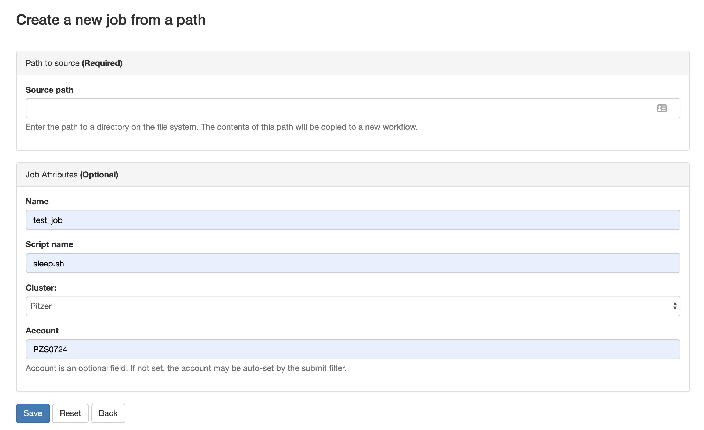

An HPC system might have thousands of nodes and thousands of users.
How do we decide who gets what and when?
How do we ensure that a task is run with the resources it needs?
This job is handled by a special piece of software called the scheduler.
On an HPC system, the scheduler manages which jobs run where and when.

The scheduler used in this lesson is PBS Pro (PBS for short).
Although PBS is not used everywhere, 
running jobs is quite similar regardless of what software is being used.
The exact syntax might change, but the concepts remain the same.

## Running a batch job

The most basic use of the scheduler is to run a command non-interactively.
This is also referred to as batch job submission.
In this case, we need to make a script that incorporates some arguments for PBS such as resources needed and modules to load. 

We will use the sleep.sh job script as an example.
   * Remember to update the project code line: `#PBS -A PZSXXX` with your own project number.

### Parameters

Let's discuss the example PBS script.
```
test.pbs
```
```
#!/bin/bash
#PBS -q debug
#PBS -A PZSXXXX
   #Give the job a name 
#PBS -N test_script
#PBS -l walltime=00:03:00
#PBS -l nodes=1:ppn=2

echo 'This script is running on:'
hostname
echo 'The date is :'
date
sleep 120
```

Comments in UNIX (denoted by `#`) are typically ignored.
But there are exceptions.
For instance the special `#!` comment at the beginning of scripts
specifies what program should be used to run it (typically `/bin/bash`).
Schedulers like PBS also have a special comment used to denote special 
scheduler-specific options.
Though these comments differ from scheduler to scheduler, 
PBS's special comment is `#PBS`.
Anything following the `#PBS` comment is interpreted as an instruction to the scheduler.

In our example, we have set the following parameters:
 
| Flag | Name | Example Setting | Notes|
| --- | --- | --- | --- |
| -q | queue | debug | See next section for queue info |
| -A | project |PZS| You must specify a project for each job |
| -N | jobname| test_script | Name of your script (no spaces, alphanumeric only) |
| -l | resource list| multiple settings| See next segment|

### Resource list
Resource list will contain a number of settings that informs the PBS scheduler what resources to allocate for your job and for how long (walltime).

#### Walltime
Walltime is represented by `walltime=00:01:01` in the format HH:MM:SS. This will be how long the job will run before timing out.  If your job exceeds this time the scheduler will terminate the job. It is recommended to find a usual runtime for the job and add some more (say 20%) to it. For example, if a job took approximately 10 hours, the walltime limit could be set to 12 hours, e.g. "-l walltime=12:00:00". By setting the walltime the scheduler can perform job scheduling more efficiently and also reduces occasions where errors can leave the job stalled but still taking up resource for the default much longer walltime limit (for queue walltime defaults run "qstat -q" command)

Resource requests are typically binding.
If you exceed them, your job will be killed.
Let's use walltime as an example.
We will request 30 seconds of walltime, 
and attempt to run a job for two minutes.

```
#!/bin/bash

#PBS -A PZSXXXX
#PBS -l walltime=00:00:30  ## <- altered to 30 seconds
#PBS -l nodes=1:ppn=2

echo 'This script is running on:'
hostname
echo 'The date is :'
date
sleep 120

```

Submit the job and wait for it to finish. 
Once it is has finished, check the error log file. In the error file, there will be
```
=>> PBS: job killed: walltime 77 exceeded limit 30

```

Our job was killed for exceeding the amount of resources it requested.
Although this appears harsh, this is actually a feature.
Strict adherence to resource requests allows the scheduler to find the best possible place
for your jobs.
Even more importantly, 
it ensures that another user cannot use more resources than they've been given.
If another user messes up and accidentally attempts to use all of the CPUs or memory on a node, 
PBS will either restrain their job to the requested resources or kill the job outright.
Other jobs on the node will be unaffected.
This means that one user cannot mess up the experience of others,
the only jobs affected by a mistake in scheduling will be their own.

#### Compute Resources and Parameters
Compute parameters, represented by `nodes=1:ppn=2` can be considered individually. The argument `nodes` specifies the number of nodes (or chunks of resource) required; `ppn` indicates the number of CPUs per chunk required.


| nodes |  ppn |  Description|
|---|---|---|
| 2|  16|  32 Processor job, using 2 nodes and 16 processors per node| 
| 4|  8|  32 Processor job, using 4 nodes and 8 processors per node| 
| 16|  1|  16 Processor job, using 16 nodes and 1 processor per node| 
| 8 | 16 | 128 Processor job, using 8 nodes and 16 processors per node|


Each of these parameters have a default setting they will revert to if not set however this means your script may act differently to what you expect.

You can find out more information about these parameters by viewing the manual page of the `qsub` function. This will also show you what the default settings are.

```
man qsub
```

## Submitting Jobs via command line

To submit this job to the scheduler, we use the `qsub` command.

```
~> qsub test.pbs
3818006.owens-batch.ten.osc.edu
~>
```
The number that first appears is your Job ID. When the job is completed, you will get two files: an Output and an Error file (even if there is no errors). They will be named {JobName}.o{JobID} and {JobName}.e{JobID} respectively.

And that's all we need to do to submit a job. 
To check on our job's status, we use the command `qstat`.

```
~> qstat -u username
owens-batch.ten.osc.edu: 
                                                                                  Req'd       Req'd       Elap
Job ID                  Username    Queue    Jobname          SessID  NDS   TSK   Memory      Time    S   Time
----------------------- ----------- -------- ---------------- ------ ----- ------ --------- --------- - ---------
3818006.owens-batch.te  kcahill     debug    test_script         --      1      2       8gb  00:03:00 Q       --   
```

{: .output}

We can see all the details of our job, most importantly if it is in the "R" or "RUNNING" state.
Sometimes our jobs might need to wait in a queue ("QUEUED") or have an error.
The best way to check our job's status is with `qstat`. It is easiest to view just your own jobs
in the queue with the `qstat -u username`. Otherwise, you get the entire queue.

## Submit Jobs with job composer on OnDemand

OnDemand also has a tool for job creation and submission to the batch system. The same information as above applies since
it still uses the same underlying queue system. In the Job Composer, you can create a new location in your home directory
for a new job, create or transfer a job script and input files, edit everything, and submit your job all from this screen.

We will run this job in the Job Composer by creating a new job from _specified path_.


You'll see the Job Options page, like this:



Fill it in as shown. You need to fill in your own path and then select Save.


To run the job, select green 'play' button.

If job successfully submitted, a green bar will appear on the top of the page.

Also, OnDemand allows you to view the queue for all systems (not just the one you are on in the shell) under Jobs, select
Active Jobs. You can filter by your jobs, your group's jobs, and all jobs.


## Queues

There are usually a number of available queues to use on your HPC. Remember: Each cluster has separate queues. Right now, we 
are looking only at the queues on Owens. The other clusters have similar queues but they are not the same. 
To see what queues are available, you can use the command `qstat -Q`. You do not have to specify a queue for most jobs. 
Your job will be routed to the appropriate queue based on node and walltime request.


> ## Submitting resource requests
>
> Submit a job that will use 1 node, 14 processors, and 5 minutes of walltime.
{: .challenge}


## Job environment variables

PBS sets multiple environment variables at submission time. The following PBS variables are commonly used in command files: 


| Variable Name |  Description |
|---|---|
| PBS_ARRAYID|  Array ID numbers for jobs submitted with the -t flag. For example a job submitted with #PBS -t 1-8 will run eight identical copies of the shell script. The value of the PBS_ARRAYID will be an integer between 1 and 8.|
| PBS_ENVIRONMENT|  Set to PBS_BATCH to indicate that the job is a batch job; otherwise, set to PBS_INTERACTIVE to indicate that the job is a PBS interactive job.|
| PBS_JOBID|  Full jobid assigned to this job. Often used to uniquely name output files for this job, for example: mpirun - np 16 ./a.out >output.${PBS_JOBID}|
| PBS_JOBNAME|  Name of the job. This can be set using the -N option in the PBS script (or from the command line). The default job name is the name of the PBS script.|
| PBS_NODEFILE|  Contains a list of the nodes assigned to the job. If multiple CPUs on a node have been assigned, the node will be listed in the file more than once. By default, mpirun assigns jobs to nodes in the order they are listed in this file |
| PBS_O_HOME|  The value of the HOME variable in the environment in which qsub was executed.|
| PBS_O_HOST|  The name of the host upon which the qsub command is running.|
| PBS_O_PATH|  Original PBS path. Used with pbsdsh.|
| PBS_O_QUEUE|  Queue job was submitted to.|
| PBS_O_WORKDIR|  PBS sets the environment variable PBS_O_WORKDIR to the directory from which the batch job was submitted PBS_QUEUE Queue job is running in (typically this is the same as PBS_O_QUEUE). |
| $TEMPDIR|  Compute node where job is assigned.|

> ## Quick Reference
>A good reference for these and other PBS variables is part of our [Batch Processing at OSC](https://www.osc.edu/supercomputing/batch-processing-at-osc) pages under [Batch-Related Command Summary](https://www.osc.edu/supercomputing/batch-processing-at-osc/batch-related-command-summary).
{: .callout}

## Canceling a job


Sometimes we'll make a mistake and need to cancel a job.
This can be done with the `qdel` command.
Let's submit a job and then cancel it using its job number.

```
> qsub test2.pbs
3818018.owens-batch.ten.osc.edu

> qstat -u kcahill
                                                                                 Req'd       Req'd       Elap
Job ID                  Username    Queue    Jobname          SessID  NDS   TSK   Memory      Time    S   Time
----------------------- ----------- -------- ---------------- ------ ----- ------ --------- --------- - ---------
3818018.owens-batch.te  kcahill     debug    test_script         --      1      2       8gb  00:03:00 Q       --          

```

Now cancel the job with it's job number. 
Absence of any job info indicates that the job has been successfully canceled.

```
> qdel 3818018
> qstat -u kcahill
>
```

> ## Submit a job from a template in the Job Composer
>
> Find MPI Hello World job in the templates
>
> Edit the job script to correct the project number
>
>Submit job and view results
{: .challenge}


### Interactive jobs

Sometimes, you will need a lot of resource for interactive use.
Perhaps it's the first time running an analysis 
or we are attempting to debug something that went wrong with a previous job.
Fortunately, PBS makes it easy to start an interactive job with `qsub -I`:

```
qsub -I -A PZSXXX -l nodes=1:ppn=28 -l walltime=00:01:00 
```
{: .bash}

You can also request interactive jobs on OnDemand using the Interative Apps menu

