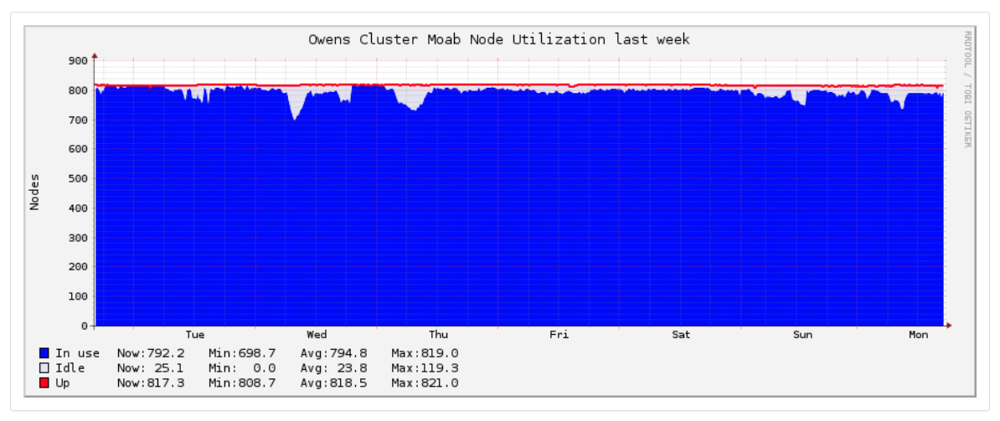
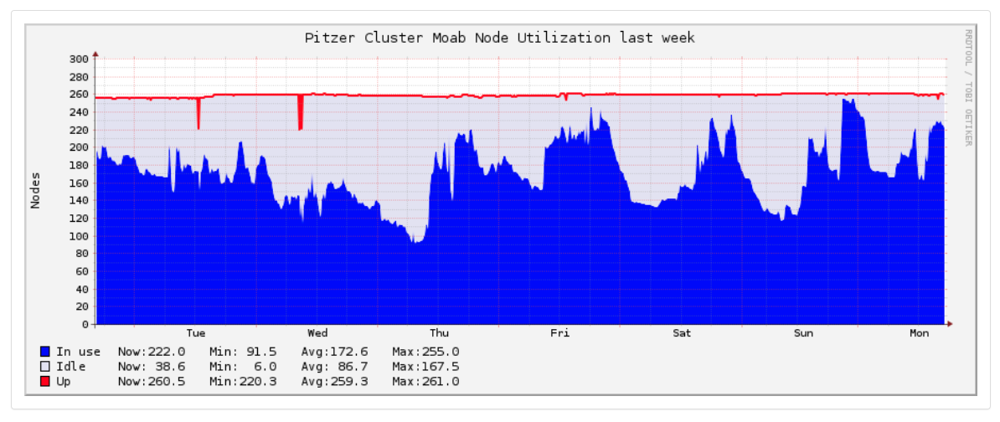

We now know virtually everything we need to know about getting stuff on a cluster.
We can log on, submit different types of jobs, use preinstalled software, 
and install and use software of our own.
What we need to do now is use the systems effectively.

## How do you choose which cluster to use?

At OSC, we have three clusters: Owens, Pitzer, and Ruby. Most users will not have access to Ruby so we will not cover it
here. But what are the differences between Owens and Pitzer and how do you decide which one to use? Luckily, 
you can switch between them pretty easily so you don't have to commit to one forever. Often it is a question of how 
busy they are.

OnDemand has a tool to show you how active the clusters are so you can decide where to submit your job. It is in the
Clusters menu, called System Status. If you select Owens and the week long view, you'll see something like this:



Compre this to Pitzer activity:



Right now, Pitzer seems the better choice.

For the standard compute nodes the main difference in **Owens has 28 cores per node** and _Pitzer has 40 cores per node_.

## Estimating required resources using the scheduler

Although we covered requesting resources from the scheduler earlier,
how do we know how much and what type of resources we will need in the first place?

Answer: we don't. 
Not until we've tried it ourselves at least once.
We'll need to benchmark our job and experiment with it before
we know how much it needs in the way of resources.

The most effective way of figuring out how much resources a job needs is to submit a test job,
and then ask the scheduler how many resources it used.
A good rule of thumb is to ask the scheduler for more time and memory than your job can use.
This value is typically two to three times what you think your job will need.

> ## Benchmarking `bowtie2-build`
> Create a job that runs the following command 
> in the same directory as our *Drosophila* reference genome
> from earlier.
> 
> ```
> bowtie2-build Drosophila_melanogaster.BDGP6.dna.toplevel.fa dmel-index
> ```
> {: .bash}
> 
> The `bowtie2-build` command is provided by the `bowtie2` module.
> As a reference, this command could use several gigabytes of memory and up to an hour of compute time, 
> but only 1 cpu in any scenario.
> 
> You'll need to figure out a good amount of resources to ask for for this first "test run".
> You might also want to have the scheduler email you to tell you when the job is done.
{: .challenge}

Once the job completes, we can look at the logfile for a statement of resources used. It will look like this

```
-----------------------
Resources requested:
nodes=2:ppn=28
-----------------------
Resources used:
cput=125:18:32
walltime=02:14:32
mem=34.824GB
vmem=77.969GB
-----------------------
Resource units charged (estimate):
12.556 RUs
-----------------------
```
{: .bash}


* **Resources Requested** - What did you request?
* **cput** - What is the total CPU time used?
* **Walltime** - How long did the job take?
* **Memory** - Amount of RAM used.
* **Virtual Memory** - Amount of total temporary memory used.
* **Resource Units** - RUs charged against your project for this job.

## Do not run jobs on the login nodes

The example above was a small process that can be run on the login node without too much disruption. However, it
is good practice to avoid running anything resource intensive on the login nodes. There is a hard limit of 1GB RAM and 
20 minutes, anything larger will be automatically stopped.

Here is an example of a job script that would run the process above on a compute node and copy the results back.

```
#PBS -N bowtie-dros
#PBS -l walltime=01:00:00
#PBS -l nodes=1:ppn=28
#PBS -A PZSXXXX
#PBS -j oe

set echo
module load bowtie2
cd $PBS_O_WORKDIR
cp Drosophila_melanogaster.BDGP6.dna.toplevel.fa $TMPDIR
cd $TMPDIR
bowtie2-build Drosophila_melanogaster.BDGP6.dna.toplevel.fa dros-index
cp *.* $PBS_O_WORKDIR

```
{: bash}

This job requests a full node on Owens, which is not needed for this calculation, but if you are unsure about how much 
memory or how many processors your job will require, it is okay to request more than you need. As you run jobs, 
you will get more comfortable identifying the amount of resources you need.

```
cd $PBS_O_WORKDIR
```
{: bash}
This line ensures we are in the correct starting directory, where the input files are located. If your input files
are not in same directory as your job script, you can specify a different location. 

```
cp Drosophila_melanogaster.BDGP6.dna.toplevel.fa $TMPDIR
```
{: bash}

Now, we can copy the input file to the compute node, known as `$TMPDIR` until the job is assigned to a node. 

```
cd $TMPDIR
bowtie2-build Drosophila_melanogaster.BDGP6.dna.toplevel.fa dros-index
cp *.* $PBS_O_WORKDIR
```
{: bash}

Finally, we move the job to the compute node and run the software. All the files will be read and written on
the compute node. This makes your job run faster and keeps the job traffic from impacting the network. In the final
line, we copy back any output files. I used a very general wildcard to copy everything back, but you can be more
specific, based on your job.

A note about memory: Memory (RAM) is allocated based on number of processors requested per node. For example, if you
request 14 ppn on Owens, that is half the available processors so your job will receive half the available memory (~64GB).
This applies to Oakley, Owens, and Pitzer. On Ruby, you cannot request less than a whole node, so there is no need to 
request memory at all.

## Playing nice in the sandbox

You now have everything you need to run jobs, transfer files, use/install software,
and monitor how many resources your jobs are using.

So here are a couple final words to live by:

* Don't run jobs on the login node, though quick tests are generally fine. 
  A "quick test" is generally anything that uses less than 1GB of memory, and 20 minutes of time.
  Anything larger will be automatically killed by the system. Remember, the login node is to 
  be shared with other users. 

* Compress files before transferring to save file transfer times with large datasets.

* Use a VCS system like git to keep track of your code. Though most systems have some form
  of backup/archival system, you shouldn't rely on it for something as key as your research code.
  The best backup system is one you manage yourself.

* Before submitting a run of jobs, submit one as a test first to make sure everything works.

* The less resources you ask for, the faster your jobs will find a slot in which to run.
  The more accurate your walltime is, the sooner your job will run.

* You can generally install software yourself, but if you want a shared installation of some kind,
  it might be a good idea to email OSCHelp@osc.edu.

* Always use the default compilers if possible. Newer compilers are great, but older stuff generally
  means that your software will still work, even if a newer compiler is loaded.

