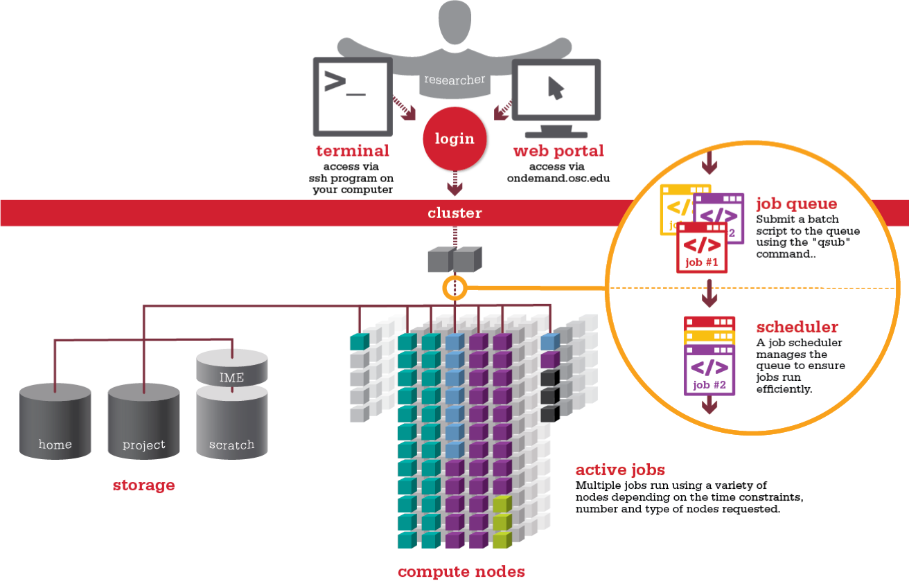
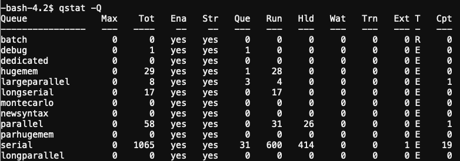

An HPC system might have thousands of nodes and thousands of users.
How do we decide who gets what and when?
How do we ensure that a task is run with the resources it needs?
This job is handled by a special piece of software called the scheduler.
On an HPC system, the scheduler manages which jobs run where and when.



The scheduler used in this lesson is SLURM.
Although SLURM is not used everywhere, 
running jobs is quite similar regardless of what software is being used.
The exact syntax might change, but the concepts remain the same.

>## Upcoming Changes to the Batch System
>
>We are changing our scheduler and resource manager from Torque and Moab to SLURM with a Torque/Moab compatibility layer. By the end of 2020, all our systems will
>use SLURM, although most Torque/Moab batch scripts will still work. If you are new to OSC or to using the batch system, it makes the most sense to learn the SLURM
>batch commands.  See [Slurm Quick Start Guide](https://slurm.schedmd.com/quickstart.html) for more SLURM information.
{: .callout}

## What is a Batch Script?

The most basic use of the scheduler is to run a command non-interactively.
This is also referred to as batch job submission.
In this case, we need to make a script that incorporates some arguments for SLURM such as resources needed and modules to load. 

We will use the sleep.sh job script as an example.


### Parameters

Let's discuss the example SLURM script, sleep.sh. Go to File Explorer and edit sleep.sh
```
sleep.sh
```
```
#!/bin/bash
#SBATCH --partition=debug
#SBATCH --account=PZSXXXX
   #Give the job a name 
#SBATCH --job-name=test_job
#SBATCH --time=00:03:00
#SBATCH --nodes=1 --ntasks-per-node=2

echo 'This script is running on:'
hostname
echo 'The date is :'
date
sleep 120
```

Comments in UNIX (denoted by `#`) are typically ignored.
But there are exceptions.
For instance the special `#!` comment at the beginning of scripts
specifies what program should be used to run it (typically `/bin/bash`). This is required in SLURM so don't leave it out!
Schedulers like SLURM also have a special comment used to denote special 
scheduler-specific options.
Though these comments differ from scheduler to scheduler, 
SLURM's special comment is `#SBATCH`.
Anything following the `#SBATCH` comment is interpreted as an instruction to the scheduler.

In our example, we have set the following parameters:
 
| Option | Name | Example Setting | Notes|
| --- | --- | --- | --- |
| --partition | queue | debug | See next section for queue info |
| --account | project |PZSXXXX | You must specify a project for each job |
| --job-name | jobname| test_script | Name of your script (no spaces, alphanumeric only) |
| --time | total job time| multiple settings| See next segment|
| --nodes | nodes requested| multiple settings| See next segment|
| --ntasks-per-node | cores per node | multiple settings| See next segment|

### Resource list
Resource list will contain a number of settings that informs the scheduler what resources to allocate for your job and for how long (walltime).

#### Walltime
Walltime is represented by `--time=00:03:00` in the format HH:MM:SS. This will be how long the job will run before timing out.  If your job exceeds this time the scheduler will terminate the job. It is recommended to find a usual runtime for the job and add some more (say 20%) to it. For example, if a job took approximately 10 hours, the walltime limit could be set to 12 hours, e.g. "--time=12:00:00". By setting the walltime the scheduler can perform job scheduling more efficiently and also reduces occasions where errors can leave the job stalled but still taking up resource for the default much longer walltime limit (for queue walltime defaults run "squeue " command)

   * Remember to update the project code line: `#SBATCH --account=PASXXXX` with your own project number.

>--Optional walltime test exercise--
>
>Resource requests are typically binding.
>If you exceed them, your job will be killed.
>Let's use walltime as an example.
>We will request 30 seconds of walltime, 
>and attempt to run a job for two minutes.
>
>```
>#!/bin/bash
>
>#SBATCH --partition=debug
>#SBATCH --account=PZSXXXX
>   #Give the job a name 
>#SBATCH --job-name=test_job
>#SBATCH --time=00:00:30
>#SBATCH --nodes=1 --ntasks-per-node=2
>
>echo 'This script is running on:'
>hostname
>echo 'The date is :'
>date
>sleep 120
>
>```
>
>Submit the job and wait for it to finish. 
>Once it is has finished, check the error log file. In the error file, there will be
>```
>This script is running on:
>p0592.ten.osc.edu
>The date is :
>Tue Sep  1 17:14:48 EDT 2020
>slurmstepd: error: *** JOB 18767 ON p0592 CANCELLED AT 2020-09-01T17:15:48 DUE TO TIME LIMIT ***
>
>```
>
>Our job was killed for exceeding the amount of resources it requested.
>Although this appears harsh, this is actually a feature.
>Strict adherence to resource requests allows the scheduler to find the best possible place
>for your jobs.
>Even more importantly, 
>it ensures that another user cannot use more resources than they've been given.
>If another user messes up and accidentally attempts to use all of the CPUs or memory on a node, 
>SLURM will either restrain their job to the requested resources or kill the job outright.
>Other jobs on the node will be unaffected.
>This means that one user cannot mess up the experience of others,
>the only jobs affected by a mistake in scheduling will be their own.
>
{: .callout}


#### Compute Resources and Parameters
Compute parameters  The argument `--nodes` specifies the number of nodes (or chunks of resource) required; `--ntasks-per-node` indicates the number of CPUs per chunk required.


| nodes |  tasks |  Description|
|---|---|---|
| 2|  16|  32 Processor job, using 2 nodes and 16 processors per node| 
| 4|  8|  32 Processor job, using 4 nodes and 8 processors per node| 
| 8|  28|  244 Processor job, using 8 nodes and 28 processor per node| 
| 1 | 40 | 40 Processor job, using 1 nodes and 40 processors per node|


Each of these parameters have a default setting they will revert to if not set however this means your script may act differently to what you expect.

You can find out more information about these parameters by viewing the manual page of the `sbatch` function. This will also show you what the default settings are.

```
man sbatch
```

> ## Setting up email notifications
> 
> Jobs on an HPC system might run for days or even weeks.
> We probably have better things to do than constantly check on the status of our job
> with `squeue`.
> Looking at the [online documentation for `sbatch`](https://slurm.schedmd.com/sbatch.html)
> (you can also google "sbatch slurm"),
> can you set up our test job to send you an email when it finishes?
> 
> Hint: you will need to use the `--mail-user` and `--mail-type` options.
{: .challenge}

## Submitting Jobs via command line
## Running a batch job
To submit this job to the scheduler, we use the `sbatch` command.

```
~> sbatch sleep.sh
Submitted batch job 40597
~>
```
The number that first appears is your Job ID. When the job is completed, you will get two files: an Output and an Error file (even if there is no errors). They will be named {JobName}.o{JobID} and {JobName}.e{JobID} respectively.

And that's all we need to do to submit a job. 
To check on our job's status, we use the command `squeue`.

```
~> squeue -u username

             JOBID PARTITION     NAME     USER ST       TIME  NODES NODELIST(REASON) 
             40597 parallel-    hello  kcahill PD       0:00      2 (ReqNodeNotAvail, Reserved for maintenance)  
```

{: .output}

We can see all the details of our job, most importantly if it is in the "R" or "RUNNING" state.
Sometimes our jobs might need to wait in a queue ("PD") or have an error.
The best way to check our job's status is with `squeue`. It is easiest to view just your own jobs
in the queue with the `squeue -u username`. Otherwise, you get the entire queue.

## Submit Jobs with job composer on OnDemand

OnDemand also has a tool for job creation and submission to the batch system. The same information as above applies since
it still uses the same underlying queue system. In the Job Composer, you can create a new location in your home directory
for a new job, create or transfer a job script and input files, edit everything, and submit your job all from this screen.

We will run this job in the Job Composer by creating a new job from _specified path_.


You'll see the Job Options page, like this:


Fill it in as shown. Path is `~/sleep` and then select Save.


To run the job, select green 'play' button.

If job successfully submitted, a green bar will appear on the top of the page.

Also, OnDemand allows you to view the queue for all systems (not just the one you are on in the shell) under Jobs, select
Active Jobs. You can filter by your jobs, your group's jobs, and all jobs.


## Queues

There are usually a number of available queues to use on your HPC. Remember: Each cluster has separate queues. Right now, we 
are looking only at the queues on Owens. The other clusters have similar queues but they are not the same. 
To see what queues are available, you can use the command `qstat -Q`. You do not have to specify a queue for most jobs. 
Your job will be routed to the appropriate queue based on node and walltime request.




> ## Submitting resource requests
>
> Submit a job that will use 1 node, 14 processors, and 5 minutes of walltime.
{: .challenge}


## Job environment variables

SLURM sets multiple environment variables at submission time. The following variables are commonly used in command files: 


| Variable Name |  Description |
|---|---|
| SLURM_ARRAY_JOB_ID|  Array ID numbers for jobs submitted with the -t flag. |
| SLURM_JOB_ID|  Full jobid assigned to this job. Often used to uniquely name output files for this job, for example: srun - np 16 ./a.out >output.${SLURM_JOB_ID}|
| SLURM_JOB_NAME|  Name of the job. This can be set using the --job-name option in the SLURM script (or from the command line). The default job name is the name of the SLURM script.|
| SLURM_NTASKS |  The number of processes requested|
| SLURM_JOB_NUM_NODES |  Number of nodes allocated |
| SLURM_JOB_PARTITION |  Queue job was submitted to.|
| SLURM_SUBMIT_DIR|  The directory from which the batch job was submitted. |
| $TEMPDIR|  Compute node where job is assigned.|


## Canceling a job


Sometimes we'll make a mistake and need to cancel a job.
This can be done with the `qdel` command.
Let's submit a job and then cancel it using its job number.

```
> sbatch test2.sh
Submitted batch job 3818018

> squeue -u kcahill
             JOBID   PARTITION     NAME     USER ST       TIME  NODES NODELIST(REASON) 
             3818018 parallel-    hello  kcahill PD       0:00      2 
```

Now cancel the job with it's job number. 
Absence of any job info indicates that the job has been successfully canceled.

```
> scancel 3818018
> squeue -u kcahill
>
```
### Interactive jobs

Sometimes, you will need a lot of resource for interactive use.
Perhaps it's the first time running an analysis 
or we are attempting to debug something that went wrong with a previous job.
Fortunately, PBS makes it easy to start an interactive job with `qsub -I`:

```
qsub -I -A PZSXXX -l nodes=1:ppn=28 -l walltime=00:01:00 
```
{: .bash}

You can also request interactive jobs on OnDemand using the Interative Apps menu

>## Upcoming Changes to the Batch System
>
>We are changing our scheduler and resource manager from Torque and Moab to Slurm. By the end of 2020, all our systems will use Slurm. The concepts described
>here will still apply, but the commands will change. See [Slurm Quick Start Guide](https://slurm.schedmd.com/quickstart.html) for more information.
{: .callout}

> ## Submit a job from a template in the Job Composer
>
> Find MPI Hello World job in the templates
>
> Edit the job script to correct the project number
>
>Submit job and view results
{: .challenge}


